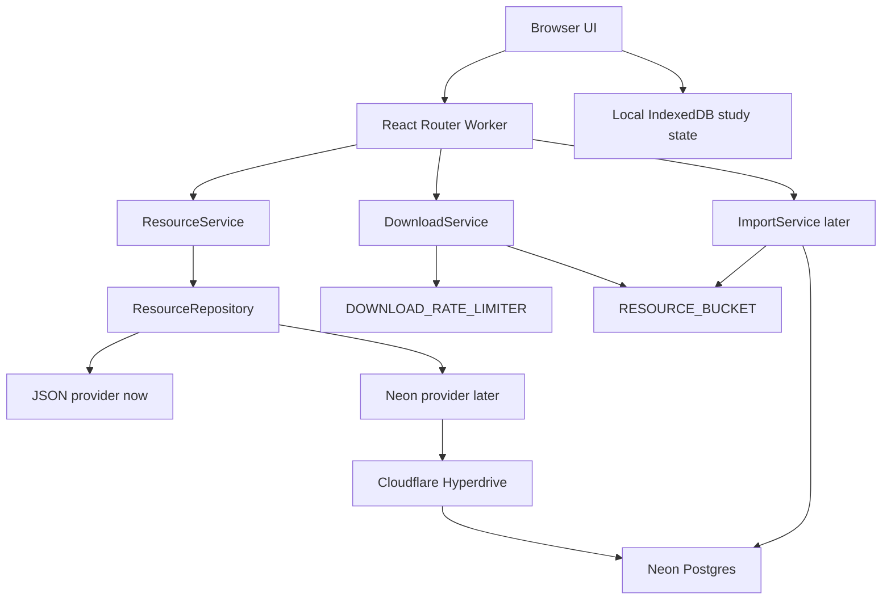

# Database And Object Storage Plan

Date: 2026-05-27
Status: Target plan for the DB migration phase

## Decision

Use Neon Postgres as the primary metadata database when the project outgrows
JSON content files. Keep large resource files in Cloudflare R2 or another
S3-compatible object store. Keep Cloudflare Worker as the application runtime,
download gate, and API boundary.

The production database connection path should be:

```text
React Router Worker -> Hyperdrive binding -> Neon Postgres
```

Direct `@neondatabase/serverless` access remains acceptable only for early
experiments or a temporary local provider. The production provider should use
Hyperdrive with `pg` or Postgres.js because Hyperdrive owns connection pooling
and fast routing from Workers to the database.

Default choices:

- Use Cloudflare R2 as the primary production object store. Keep S3-compatible
  key/provider fields so migration remains possible, but do not split active
  storage across providers without a concrete need.
- Use raw SQL migrations with a small repository-owned runner at first. Add
  Drizzle Kit or another migration framework only if schema growth makes raw SQL
  review too costly.
- Use Neon branches for preview/staging by default. Move to a separate Neon
  project only if isolation, quota, or billing needs demand it.
- Keep download decision logging disabled initially. Add coarse telemetry later
  only when real abuse or cost data proves the need.
- Keep study state anonymous and local-first until account sync becomes a
  product requirement.

## Current State

The app currently uses:

- Cloudflare Worker for the React Router request handler.
- R2 binding `RESOURCE_BUCKET` for owned files.
- Rate Limit binding `DOWNLOAD_RATE_LIMITER` for download gate protection.
- JSON metadata in `content/cet4/resources.json` and
  `content/cet6/resources.json`.
- Browser IndexedDB for local-first favorites, study records, and cache marks.

It does not currently use Neon, D1, KV, Durable Objects, Queues, or a server-side
user account database.

## Final Ownership Boundaries

| Concern | Owner | Notes |
|---|---|---|
| Resource metadata | Neon Postgres | Structured rows, source facts, status, access policy, import state |
| Large file bytes | R2/S3 | PDF, audio, ZIP, images, and extracted raw assets |
| Download decision | Worker service | Validates policy, rate limit, budget mode, then returns a URL or denial |
| Public metadata browsing | Worker + cache | Cacheable list/detail/search payloads |
| Private study state | Browser IndexedDB | Stays local unless account sync is explicitly added later |
| Semantic retrieval | Optional vector store | Chunk text only after legal-source extraction exists |
| Deployment config | Wrangler | Bindings, non-secret vars, dry-run validation |
| Secrets | Cloudflare secrets / Hyperdrive config / CI secrets | Never in `vars`, docs, commits, or logs |

Do not put PDF/audio/ZIP/image bodies into Postgres. The database stores object
keys, hashes, size, MIME type, policy, source, and processing status.

## Runtime Architecture



## Data Model Draft

The schema should be narrow enough to migrate from JSON without inventing an
admin system too early, but rich enough to support legal provenance and import
workflows.

### `resources`

| Column | Type | Notes |
|---|---|---|
| `id` | `text primary key` | Stable slug, matches current route ids |
| `level` | `text not null` | `cet4`, `cet6` |
| `type` | `text not null` | `papers`, `mocks`, `skills`, `listening`, `resources` |
| `title` | `text not null` | User-facing title |
| `summary` | `text not null` | Short normalized description |
| `year` | `integer` | Nullable only if future resource types need it |
| `source_id` | `uuid` | FK to `resource_sources` |
| `license_status` | `text not null` | `owned`, `restricted`, `external` |
| `host_mode` | `text not null` | `owned`, `restricted`, `external` |
| `download_policy` | `text not null` | `signed`, `external`, `none` |
| `external_url` | `text` | For externally hosted resources |
| `lifecycle_status` | `text not null` | `draft`, `active`, `archived`, `blocked` |
| `created_at` | `timestamptz not null default now()` | |
| `updated_at` | `timestamptz not null default now()` | |

### `resource_tags`

Use a join table instead of a Postgres array if tags need filtering and cleanup.

| Column | Type | Notes |
|---|---|---|
| `resource_id` | `text not null` | FK to `resources` |
| `tag` | `text not null` | Lower-normalized display tag |

Primary key: `(resource_id, tag)`.

### `resource_sources`

| Column | Type | Notes |
|---|---|---|
| `id` | `uuid primary key` | |
| `title` | `text not null` | Source name |
| `url` | `text` | Original or external location |
| `ownership_status` | `text not null` | `owned`, `licensed`, `public`, `external`, `unknown` |
| `attribution` | `text` | Human-readable attribution |
| `notes` | `text` | Legal/source notes |
| `created_at` | `timestamptz not null default now()` | |

### `resource_files`

| Column | Type | Notes |
|---|---|---|
| `id` | `uuid primary key` | |
| `resource_id` | `text not null` | FK to `resources` |
| `kind` | `text not null` | `pdf`, `audio`, `zip`, `image` |
| `label` | `text not null` | Display label |
| `storage_provider` | `text not null` | `r2`, `s3`, `external` |
| `storage_key` | `text` | Private object key, not a public URL |
| `external_url` | `text` | Only for external-hosted files |
| `mime_type` | `text` | Explicit MIME from import/upload |
| `byte_size` | `bigint` | |
| `sha256` | `text` | Deduplication and integrity |
| `cacheable` | `boolean not null default false` | Browser/local cache hint |
| `access_policy` | `text not null` | `signed`, `external`, `none` |
| `processing_status` | `text not null` | `pending`, `ready`, `failed`, `blocked` |
| `created_at` | `timestamptz not null default now()` | |

Unique constraint: `(resource_id, storage_key)` where `storage_key is not null`.

### `resource_imports`

| Column | Type | Notes |
|---|---|---|
| `id` | `uuid primary key` | |
| `input_kind` | `text not null` | `file`, `url`, `manual` |
| `input_name` | `text not null` | Original file name or URL label |
| `source_id` | `uuid` | Optional FK |
| `draft_payload` | `jsonb not null default '{}'` | Generated metadata draft |
| `status` | `text not null` | `draft`, `reviewing`, `committed`, `rejected`, `failed` |
| `error_message` | `text` | Non-secret failure summary |
| `created_at` | `timestamptz not null default now()` | |
| `updated_at` | `timestamptz not null default now()` | |

### `download_decisions`

This table is optional at first. Add it only when real abuse/cost monitoring is
needed. Store reason codes and coarse actor hashes, not full request bodies.

| Column | Type | Notes |
|---|---|---|
| `id` | `uuid primary key` | |
| `resource_id` | `text` | |
| `file_id` | `uuid` | |
| `actor_hash` | `text` | Hash of IP/session actor key |
| `decision` | `text not null` | `allowed`, `denied`, `rate_limited`, `budget_closed` |
| `reason_code` | `text not null` | Machine-readable reason |
| `created_at` | `timestamptz not null default now()` | |

### `resource_chunks`

Do not add this until import and legal-source extraction exist.

| Column | Type | Notes |
|---|---|---|
| `id` | `uuid primary key` | |
| `resource_id` | `text not null` | FK to `resources` |
| `file_id` | `uuid` | FK to `resource_files` |
| `chunk_index` | `integer not null` | |
| `text` | `text not null` | Extracted text only |
| `page_start` | `integer` | For PDFs |
| `page_end` | `integer` | For PDFs |
| `embedding_id` | `text` | Optional external vector id |
| `created_at` | `timestamptz not null default now()` | |

## Provider Shape

Keep the existing `ResourceRepository` contract and add a DB-backed provider
behind the same interface. The first DB provider should be read-only for list,
detail, and search until import flows are ready.

```ts
export type ResourceRepository = {
  list(filters?: ResourceFilters): Promise<ResourceRecord[]>
  findById(resourceId: string): Promise<ResourceRecord | null>
}
```

Migration rule: UI and route modules should not know whether resources came
from JSON or Neon. Only server repository composition should choose the provider.

Recommended future files:

```text
app/server/db.server.ts
app/server/resource-repository.db.server.ts
app/server/resource-repository.json.server.ts
app/server/resource-repository.conformance.test.ts
db/migrations/*.sql
scripts/import-json-resources-to-db.ts
```

## Cloudflare And Neon Configuration

### Production

Wrangler should eventually add a Hyperdrive binding:

```jsonc
{
  "hyperdrive": [
    {
      "binding": "HYPERDRIVE",
      "id": "<cloudflare-hyperdrive-id>"
    }
  ]
}
```

The Neon connection string belongs in the Hyperdrive configuration or a secret,
not in `wrangler.jsonc` `vars`.

Use a Neon role dedicated to the app connection, for example
`cet_app_hyperdrive`. Use a separate migration role for schema changes if the
workflow becomes automated.

### Local Development

Local development should support two paths:

- JSON provider by default, requiring no Neon account.
- DB provider only when an explicit local env flag is set.

Example future local env shape:

```text
RESOURCE_REPOSITORY_PROVIDER=json
# RESOURCE_REPOSITORY_PROVIDER=neon
# DATABASE_URL=postgres://...
```

Do not make `npm run dev` require a remote Neon database until the app actually
needs DB-only behavior.

### Preview And Staging

Cloudflare environment bindings and vars are not inherited automatically across
environments. When `env.preview` or `env.production` is introduced, repeat the
R2, Rate Limit, Hyperdrive, and vars intentionally for each environment.

Recommended separation:

| Environment | Neon | R2 | Purpose |
|---|---|---|---|
| `local` | Local/branch database or JSON | local simulator or disabled | Fast development |
| `preview` | Neon preview branch/project | preview bucket | PR smoke and migration rehearsal |
| `production` | Neon production branch/project | production bucket | Real data |

## Migration Roadmap

### Step 1: Keep JSON As Source Of Truth

- Preserve current JSON provider.
- Add this plan and keep service boundaries stable.
- Continue hardening R2/download protection.

### Step 2: Add Schema And Read-only DB Provider

- Add raw SQL migrations for resources, sources, files, tags, and imports.
- Add a small migration runner that can apply SQL files and report pending
  files without mutating production during dry runs.
- Add `DbResourceRepository`.
- Add repository conformance tests shared by JSON and DB providers.
- Add a seed/import script from current JSON into Neon.
- Keep UI unchanged.

### Step 3: Switch Reads Behind A Feature Flag

- Add `RESOURCE_REPOSITORY_PROVIDER=json|neon`.
- Run both providers in tests against the same fixture expectations.
- Keep JSON as fallback until DB import quality is proven.

### Step 4: Add Import Workflow

- Upload allowed files to R2 under deterministic keys.
- Insert metadata rows and file manifests into Neon.
- Require user confirmation before a resource becomes `active`.
- Store import errors and source notes.

### Step 5: Add Search And Optional Chunks

- Generate metadata indexes from Neon records.
- Add extracted text chunks only for files with a clear legal/source status.
- Store embeddings in a vector store only after chunk provenance is reliable.

## Cost And Abuse Rules

- Browse/search endpoints should prefer cacheable metadata payloads.
- Download decisions remain `no-store`.
- Download gate must check rate limit and budget mode before R2 reads.
- Worker should not proxy large files as the normal path.
- The database should not be queried on every file byte request when a signed
  object URL can carry the approved decision.
- Store only coarse decision logs; avoid full IPs, full headers, and file bodies.
- Keep a `DOWNLOAD_BUDGET_MODE=closed` emergency switch independent of DB state.

## What Not To Build Yet

- Account sync for local study state.
- Vector search over unreviewed files.
- Admin dashboard for bulk moderation.
- Queue-based extraction pipeline.
- Terraform/IaC for every resource.
- High-volume download decision logging.

Those are valid later, but not needed before the DB provider and import slice
prove the core boundary.

## Verification Gates For The DB Phase

Before switching production reads to Neon:

```bash
npm run typecheck
npm test
npm run build
npm run check
```

Additional DB-phase gates:

```bash
# Future commands, to be added with the DB implementation.
npm run db:migrate:dry-run
npm run db:seed:check
npm run repository:conformance
```

Production smoke should cover:

- `/api/resources` returns the same public shape from Neon as JSON.
- `/api/resources/:id` returns detail data without exposing storage internals.
- `/api/resources/:id/download` still fails closed when rate limiting or budget
  mode requires it.
- R2 file access still requires an allowed download decision.

## Closed Decisions

- Migration ownership: raw SQL files plus a small repo-owned runner.
- Preview data: Neon branch per preview/staging environment.
- Download telemetry: disabled at first; prefer Cloudflare Analytics Engine for
  high-volume coarse telemetry later, and Neon only for low-volume audit rows.
- Auth and sync: local-first anonymous study state stays the default.

## Remaining Open Questions

- Which exact auth provider to use if account sync becomes necessary.
- Whether import processing eventually needs Queues or can stay request-driven
  for the first real slice.
