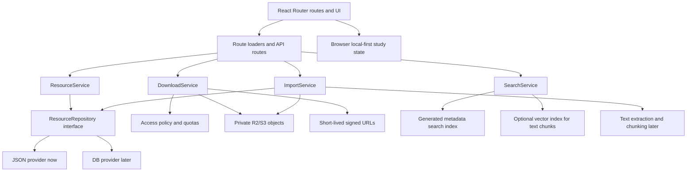

# CET Workbench Refactor Design

Date: 2026-05-22
Status: Design approved for planning; implementation not started

## Summary

Refactor CET ExamSystem from a small resource catalog into a durable CET-4/CET-6 personal resource workbench. The product should help Zach collect, review, search, and safely access user-owned or legally sourced study materials. It should not become a public exam-paper mirror or a clone of an existing question-bank site.

The target architecture is:

- DB-ready metadata for resources, sources, files, imports, and access policy.
- Private R2/S3 object storage for large files such as PDF, audio, ZIP, and images.
- Generated search indexes for public metadata and user library retrieval.
- Optional vector indexes for extracted text chunks only, not for file-body storage.
- Local-first study state for favorites, progress, recently viewed resources, and user-side notes.
- A download gate that decides access, rate limits, quotas, and signed URL issuance before object storage is touched.

The smallest acceptable implementation slice should preserve these final boundaries even while the backing provider remains the current JSON content files.

## Research Inputs

- Current repo conventions in `AGENTS.md`: React Router Framework Mode, npm, Base UI, route modules, server/content helpers, R2/download policy boundaries, and local-first study state.
- Current implementation: JSON resources under `content/`, Zod resource schemas in `app/lib/resources.ts`, resource and download helpers in `app/server/content.server.ts`, route APIs under `app/routes/`, and browser-local study state in `app/lib/local-first.ts`.
- Yohaku React Router migration references:
  - `innei-dev/yohaku#138`: complete Next.js to React Router 7 migration, route/server conventions, route manifest concerns, structure guard, and verification gates.
  - `innei-dev/yohaku#143`: layout collision fixed by replacing absolute positioning with normal flow and slots.
  - `innei-dev/yohaku#141`: design work backed by a written Superpowers design spec before implementation.
- UI reference sites supplied by Zach:
  - Craftwork curated websites for modern product and web-app density patterns.
  - One Page Love for strong first-screen composition, but this app should not become a marketing one-pager.
  - Component Gallery for interaction patterns and design-system vocabulary.
  - Rebrand Gallery for restrained identity and brand-system clarity.

## Product Positioning

This project should be a quiet study workbench, not a public content moat.

The difference from a public exam-paper resource site is ownership and workflow:

- Public site: publishes a large shared catalog, optimizes for discovery, SEO, and redistribution.
- CET workbench: helps a user organize legal materials, import personal files, review metadata, control downloads, and maintain study progress.

The core value should come from the workflow around materials:

- Bring your own legal sources.
- Normalize metadata.
- Keep files private by default.
- Search across a personal library.
- Track study state locally first.
- Add later intelligence through text extraction, chunking, and semantic retrieval.

## Goals

- Preserve a path from JSON content today to DB-backed resources later.
- Keep large files out of the database.
- Put download policy and abuse controls behind server-side services.
- Make the UI feel like a study operations tool: calm, dense, and fast to scan.
- Use Base UI as an accessibility primitive layer for controls without turning it into a visual theme.
- Keep React Router route modules thin: validation, loader/action wiring, metadata, and page rendering only.
- Make future import and search work possible without rewriting the first refactor.

## Non-goals

- Do not build a public exam-paper mirror.
- Do not scrape, clone, or redistribute third-party catalogs.
- Do not store PDF/audio/ZIP/image file bodies in the database.
- Do not store large files as vectors.
- Do not ship a full admin backend in the first phase.
- Do not redesign the app as a marketing landing page.
- Do not bypass route loaders, resource APIs, or local-first storage just to make a visual demo.

## Target Architecture



### Boundary Rules

- UI components receive resource view models. They do not map raw enum policy into download behavior.
- Route loaders validate URL params, call services, and return typed data.
- `ResourceService` owns list/detail/related/search input normalization and view model composition.
- `DownloadService` owns policy checks, file validation, rate limits, quotas, cooldowns, bot signals, and signed URL creation.
- `ResourceRepository` hides whether data comes from JSON, generated indexes, or a DB.
- Object storage keys and bucket details stay server-side.
- Local-first state remains browser-owned and is not moved into loaders.
- Static, manifest, API, and resource routes stay ordered before broad dynamic routes when route config changes.

## Data And Storage Design

### Metadata

Metadata should become DB-ready even before a DB exists:

- `Resource`: id, level, type, title, summary, year, tags, source, license status, host mode, lifecycle status, created/updated timestamps.
- `ResourceFile`: id, resource id, kind, label, storage key or external URL, size, checksum, cacheability, access policy, processing status.
- `ResourceSource`: source title, source URL, ownership/legal status, notes, attribution fields.
- `ResourceImport`: import id, input file/source, user confirmation state, generated metadata draft, processing status, errors.
- `ResourceAccessDecision`: decision facts for download requests, without storing sensitive file contents.
- `ResourceChunk`: extracted text chunk metadata and optional embedding id for semantic retrieval.

The current `content/*.json` shape can remain the seed format, but service code should not assume JSON is the permanent storage layer.

### Large Files

Large files belong in private R2/S3 buckets:

- PDF, audio, ZIP, and image files are object-storage assets.
- The database stores metadata, policy, checksums, and storage keys.
- Workers should not stream large file bodies as a proxy path.
- Downloads should use short-lived signed URLs after policy approval.

### Search

Search should start with generated metadata indexes:

- Title, summary, tags, year, level, type, and source fields are enough for phase 1.
- The index can be built from JSON now and from DB records later.
- API responses should stay normalized so the UI does not care about index origin.

### Vector Usage

Vectors are useful for semantic retrieval over text, not for storing files.

Use vectors only after a legal-source import pipeline exists:

- Extract text from allowed PDF or HTML sources.
- Split text into chunks with resource and page/time metadata.
- Store embeddings for chunks.
- Link search results back to the original resource and file.

Do not chunk binary file bodies into vector storage as the primary persistence model.

## Cost And Abuse Controls

Cost control is a product requirement because the target deployment is serverless.

### Request Path

1. Public metadata routes are cacheable.
2. Download request enters `DownloadService`.
3. Service validates resource id, file id, host mode, license status, and policy.
4. Service applies bot checks, per-IP/session cooldowns, quotas, and budget mode.
5. Only approved requests create a signed object-storage URL.
6. The browser downloads from object storage or CDN directly.

### Controls

- Cache public metadata aggressively with safe revalidation.
- Do not proxy large files through Workers.
- Use short TTL signed URLs.
- Rate-limit download decisions before any object-storage operation.
- Add low-cost cooldowns for repeated clicks on the same file.
- Track decision logs with reason codes, not full request bodies.
- Add a budget degradation mode:
  - Metadata browsing remains available.
  - New signed downloads can be temporarily disabled or slowed.
  - UI shows a controlled unavailable state instead of retry loops.
- Keep private buckets private by default.
- Use explicit allow/deny states rather than guessing from file existence.

## API Contract

All route APIs should return normalized payloads and a unified error shape:

```ts
type ApiError = {
  error: {
    code: string
    message: string
  }
}
```

Initial API shape:

- `GET /api/resources`: list resource summaries with filters.
- `GET /api/resources/:id`: return one resource detail view model.
- `GET /api/search`: search normalized resource summaries.
- `GET /api/resources/:id/file`: return file metadata and source explanation.
- `POST /api/resources/:id/download`: return a download decision or signed URL payload.

Cache policy:

- Public list/detail/search metadata can be cached.
- Download decisions and signed URL responses should be `no-store`.
- Import and private-library APIs should be authenticated and `no-store` when added.

## UI And Interaction Design

The UI direction is a quiet editorial workbench:

- iPad-first, but dense enough for desktop.
- Search and filtering are prominent on library pages.
- Downloading stays on detail pages.
- Home is a study dashboard, not a landing page.
- Detail pages are processing stations: status, facts, files, actions, related materials.
- Import is the differentiator: a user adds legal materials and confirms generated metadata.

### Home

Home should answer:

- What should I continue studying?
- What did I recently import or open?
- Is the local library healthy?
- Which level or resource type needs attention?

It should not use oversized marketing hero copy.

### Library

Library should be optimized for scanning:

- Search field, filters, sort, and result count near the top.
- Resource rows or compact repeated items.
- Primary distinguishing content on the left.
- Favorite and local state controls on the right.
- Clear empty, loading, and error states.

### Detail

Detail should show:

- Resource identity and provenance.
- Legal/source status.
- Available files and their access state.
- Download decisions with clear reasons.
- Local study actions.
- Related resources.

Action areas should use normal flow or explicit slots, not absolute positioning that can overlap content.

### Import

Import can begin as a skeleton but must follow the final boundary:

- Select file or external legal source.
- Show processing status.
- Present metadata draft.
- Require user confirmation before committing metadata.
- Store file in object storage later, not DB.

## Base UI Usage

Base UI should remain headless:

- Use Base UI for interactive primitives such as Button, Toggle, ToggleGroup, Field, Input, Dialog, Popover, Select, Tabs, and Tooltip.
- Keep styling in `app/app.css` and small project wrappers.
- Share visual classes between buttons and links, but preserve link semantics with `Link`/`NavLink`.
- Keep wrappers thin and semantic.
- Verify SSR build and hydration after adding new Base UI primitives.

## Phase Roadmap

### Phase 1: Domain And Service Boundary

Purpose: make the current JSON app use final-state interfaces.

Changes:

- Add `ResourceRepository` and a JSON-backed provider.
- Add `ResourceService` for list/detail/related/search normalization.
- Add `DownloadService` for access decisions.
- Move raw label/download mapping out of UI components.
- Add typed summary/detail/download decision view models.
- Standardize API error responses.
- Add focused tests for service behavior and route API errors.

Verification:

- `npm run typecheck`
- `npm test`
- `npm run build`
- Smoke `/`, `/cet4/papers`, and `/resources/cet4-paper-2024-12-a`.

### Phase 2: Workbench Information Architecture

Purpose: turn the app into a resource workbench without changing storage.

Changes:

- Redesign Home as dashboard/local status/continue work.
- Redesign Library as a dense searchable/filterable resource view.
- Redesign Detail as a file and study action station.
- Add Import skeleton behind the real service boundary.
- Expand empty/loading/error states.
- Use Base UI primitives for controls.

Verification:

- Same build/test gates as phase 1.
- Browser smoke at desktop and narrow widths.
- Confirm no text overlap, no nested cards, and no low-contrast small text.

### Phase 3: Storage And Cost-Control Boundary

Purpose: make download and file storage serverless-safe.

Changes:

- Introduce file manifest fields that separate metadata from object storage.
- Add signed URL interface with a local stub or environment-guarded implementation.
- Add rate-limit/quota/cooldown interfaces.
- Add download decision reason codes.
- Set cache headers for public metadata and no-store for download decisions.
- Ensure no route proxies large file bodies.

Verification:

- Unit tests for access decisions and denial cases.
- Build and smoke download-denied/download-external/download-signed states.

### Phase 4: DB And Import Migration

Purpose: replace JSON as the primary provider when the app has enough real imported data.

Changes:

- Add DB schema and migrations for metadata, files, sources, imports, and access decisions.
- Treat current JSON as seed/import fixture data.
- Add import pipeline that writes metadata and file manifests.
- Generate search indexes from DB records.
- Add user-private library and sync boundaries.
- Add text extraction/chunking only for legal-source files.

Verification:

- Migration tests or dry-run scripts.
- Repository conformance tests shared by JSON and DB providers.
- Import happy-path and rejection-path tests.

## First Implementation Slice

Start with phase 1.

This is the right first slice because it validates the hardest-to-reverse decisions:

- Service boundaries.
- Repository abstraction.
- Download policy ownership.
- API shape.
- UI view model contract.

It avoids premature DB work while preventing the current JSON shape from leaking further into the UI.

## Risks And Mitigations

- Risk: The app drifts back into a public catalog.
  - Mitigation: keep product language and route IA centered on library, import, provenance, and personal study state.
- Risk: Download costs become unbounded.
  - Mitigation: gate before storage access, sign short-lived URLs, cache metadata, add cooldowns and budget mode.
- Risk: The repository abstraction becomes too large too early.
  - Mitigation: keep the first interface narrow: list, getById, listRelated, search, file lookup.
- Risk: Vector work is started before legal-source text extraction exists.
  - Mitigation: keep vector code out of phase 1 and phase 2.
- Risk: UI redesign becomes decorative.
  - Mitigation: tie every screen to a workbench task and keep home/dashboard, library, detail, and import flows usable first.

## Open Decisions Before Coding Phase 2

- Whether Import appears as a top-level route immediately or behind a secondary action.
- Whether user-private state stays anonymous/local-only for longer or gets account sync in phase 4.
- Which DB target to use when migration starts.
- Which object storage provider is primary in production: Cloudflare R2, S3, or compatible S3 API.

## Implementation Readiness Checklist

- Zach approves this written design.
- Phase 1 implementation plan lists concrete files and test cases.
- Existing unrelated working tree changes are isolated from the implementation commit.
- Every phase keeps the app aligned with React Router route modules, Base UI primitives, local-first state, and server-only download policy.
